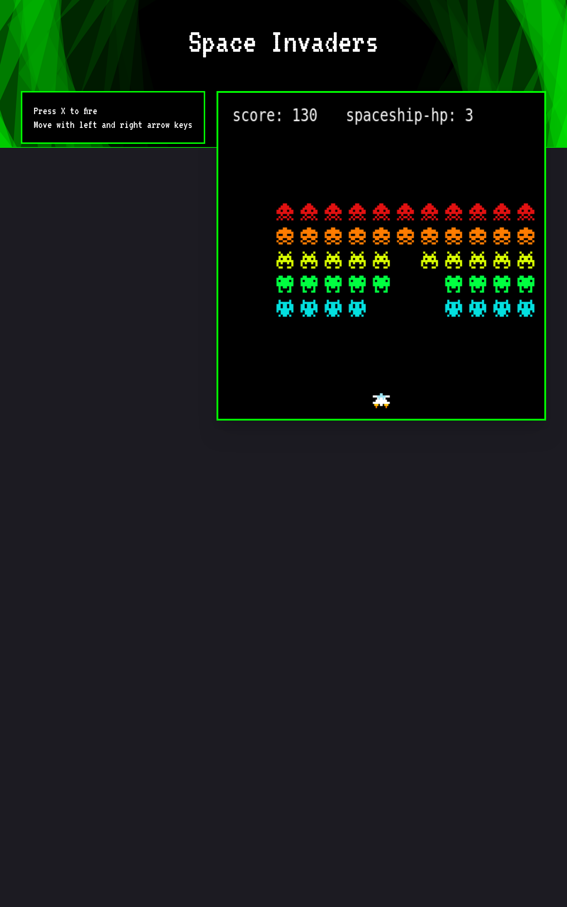

# Space Invaders




---

## 📕 About

A simple Space Invaders implementation on Typescript.

---

## ⚒️ Used Technologies

To develop this page, I used these technologies:

- HTML5
- CSS3
- Typescript
- Vite

---

## ✨ How it works

The project has "blueprints" of how everything must work, but the implementations are completely up to the developer. In this case,
I used the following architecture:

```
engine
  |-renderer
  |-stores
  |-collision system
  |-input system
  |-logic scripts
  |-renderable objects
  |-engine state (gathers info from all systems and returns an object containing them + some utilities)
```

First, the engine implementation ([Engine2d](./src/lib/core/Engine2d.ts) in this project) receives a Renderer, Collision System
and Input System, so it can handle the game loop properly. Then, for each frame, it runs the logic scripts, that can perform any
kind of operation before the renderable objects are rendered. Finally, each renderable object is updated (each must handle this)
and rendered on screen.

For special logic like score and hp, the engine offers access to it's stores, that can hold any value in a key-pair manner. To edit
the stores, any object must request the engine to do so. No system can be directly accessed without the engine's permission.

Lastly, each time a new game is created, the engine's state is wiped.

---

## 🤝 Be a Contributor

Have any idea that can help boost the project, and want to share it? It's simple!

1. Fork the project
2. Modify what you want
3. Commit the changes
4. Open a Pull Request

---

## 🔓 License

This project is under license. Click [here](./LICENSE.md) for details.
